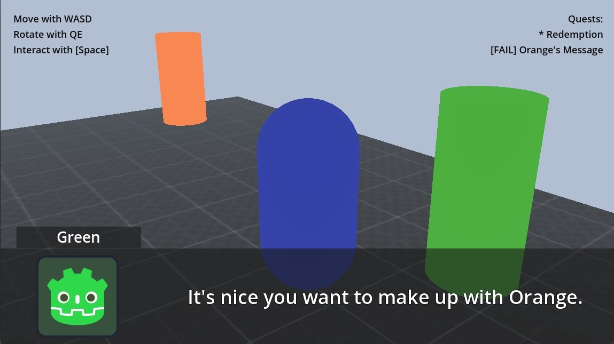

# ConvoQuestFramework

This demo showcases the ConvoQuestFramework.  It is written for Godot 4.0.

The ConvoQuestFramework is a lightweight but flexible system for integrating conversations, quests, and inventory into your Godot game.  Quests and conversations are defined in human-readable JSON files for easy writing and extending.

